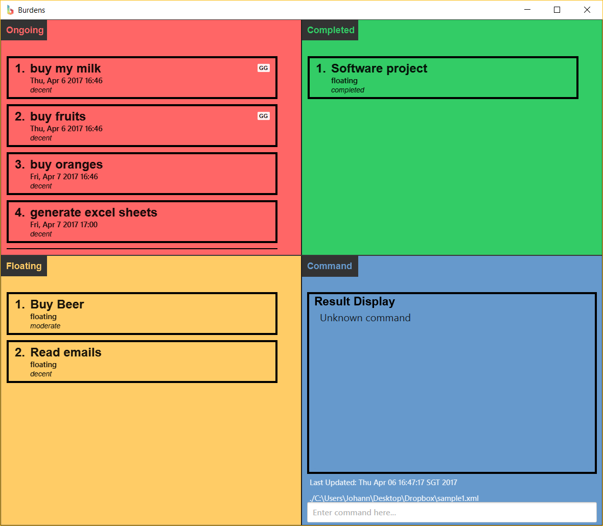

# Burdens: User Guide

By : `TEAM W09-B1`  &nbsp;&nbsp;&nbsp;&nbsp; Since: `Mar 2017`  &nbsp;&nbsp;&nbsp;&nbsp;

1. [Introduction](#1-introduction)
2. [Quick Start](#2-quick-start)
3. [Features](#3-features)
   > 3.1. [Add tasks](#31-adding-a-task--add)<br/>
     3.2. [Delete tasks](#32-deleting-a-task--delete)<br/>
     3.3. [Edit tasks](#33-editing-a-task--edit)<br/>
     3.4. [Find tasks](#34-finding-a-specific-task--find)<br/>
     3.5. [List tasks](#35-listing-all-tasks--list)<br/>
     3.6. [Select tasks](#36-selecting-a-task--select)<br/>
     3.7. [Mark tasks as complete](#37-marking-a-task-as-complete--complete)<br/>
     3.8. [Mark tasks as incomplete](#38-marking-a-task-as-incomplete--incomplete)<br/>
     3.9. [Undo](#39-undo-the-previous-command--undo)<br/>
     3.10. [Redo](#310-redo-a-command--redo)<br/>
     3.11. [Revert](#311-revert--revert)<br/>
     3.12. [Unrevert](#312-unrevert--unrevert)<br/>
     3.13. [Specifying the data storage location](#313-specifying-the-data-storage-location--cd)<br/>
     3.14. [Import as Google Calendar file](#314-import-as-google-calendar-file--import)<br/>
     3.15. [Export as Google Calendar file](#315-export-as-google-calendar-file--export)<br/>
     3.16. [Use an alias](#316-using-an-alias--use)<br/>
     3.17  [Show all aliases](#317-show-all-aliases--aliases)<br/>
     3.18. [Show the day and date](#318-showing-the-day-and-date--cal)<br/>
     3.19. [Save](#319-saving-the-data)<br/>
     3.20. [Reset](#320-resetting-burdens--reset)<br/>
     3.21. [Help](#321-viewing-help--help)<br/>
     3.22. [Exit](#322-exiting-the-program--exit)<br/>
4. [FAQ](#4-faq)
5. [Command Summary](#5-command-summary)

# 1. Introduction

Hello!<br/>
<br/>
Are you overwhelmed by your daily tasks and deadlines in life?<br/>
<br/>
Enter **Burdens**.<br/>
<br/>
A task manager that structures your tasks and deadlines<br/>
using your keyboard commands with a beautiful interface.<br/>
<br/>
Read on to discover how to install and use **Burdens**<br/>
to make sense of your daily life activities.<br/>
<br/>
No more **burdens**.

# 2. Quick Start
**Download**
Ensure you have Java version `1.8.0_60` or later installed.

1. Download the latest Burdens.jar from the [releases](https://github.com/CS2103JAN2017-W09-B1/main/releases) tab.
2. Copy the jar file to the folder you want to use as the home folder for Burdens.
**Launch**
To start Burdens, double click on **Burdens.jar**. Hello!<br/>
Here is the greeting window at the very first startup.
   > 
As shown, there will be some sample tasks to give you a sense of what your tasks will look like.<br/>

You will see four sections:

- Ongoing: Shows a list of ongoing tasks with deadlines. Recurring tasks will have a tag "R" attached to it.
- Floating: Shows a list of tasks without deadlines.
- Completed: Shows a list of completed tasks.
- Command: Displays the results of a command and contains the command box.

Each square has their own respective lists and indexes.

Type a command in the command box and press <kbd>Enter</kbd> to execute it.

e.g. typing `help` and pressing <kbd>Enter</kbd> will open the Help window.

Refer to the [Features](https://github.com/CS2103JAN2017-W09-B1/main/blob/master/docs/UserGuide.md#features) section below for details of each command.

# 3. Features

To use Burdens effectively, we need to master the following commands.

> ### Commands
> **Please note the following:**
> * Command words are case-sensitive, please follow the command summary.
> * Words with a colon `:` at the end are keywords.
> * Items in `<Angle Brackets>` are parameters.
> * Items with `...` after them can have multiple instances.
> * Parameters can be in any order.
> * The following section heads show a description of the command and the command to be used.

### 3.1. Adding a task : `add`

Let's begin to add a task to Burdens.

Here are the **allowed formats**:

* `add <title>` - adds a floating task with the title to Burdens.
* `add <title> for: <deadline>` - adds a task which has to be done by the specified deadline. Please use the keyword `for: `.
* `add <title> for: <start of deadline> to <end of deadline>` - adds an event which will take place between start and end of the deadline. Note the keyword `for:` and `to`.
* `add <title> for: every <day>` - adds a recurring task which has to be done by the specified deadline.
* `add <title> priority: <1 to 5>` - adds a floating task with a priority level.
* `add <title> note: <instructions>` - adds a floating task with instructions.
* `add <title> #<tag>...` - adds a floating task with a tag. Note that you can have multiple tags.
For full details of each parameter, please view their formats in their respective sections below.

The full allowed command format is therefore:

* `add <title> for:<deadline> priority:<priority level> note:<instructions> #<tag>...`

#### Date Time Format
Let us show you the parameters to fill for `<start of deadline>` and `<end of deadline>`.
Firstly, type the "for: " tag after the add command.<br>
Burdens employs natural date formats.<br>
You are free to use any of the date formats and time formats below.<br>

| Deadline Format | Example(s)                |
|-----------------|---------------------------|
| Floating        | `nothing`/floating        |
| Month/day       | 1/23                      |
| Month/day time  | 1/23 6pm                  |
| Day Month       | 1 Oct                     |
| Month Day       | Oct 1                     |
| Day of the Week | Wed, Wednesday            |
| Relative date   | today, tomorrow, next fri |

**Tip** : You can use holidays like Christmas as well!<br>

#### Priority Format
Let us show you the parameters to fill for `<priority level>`.<br>
Remember to put the `priority:` keyword.<br>
Burdens will assign this numbers as a unique tag.<br>
The priority parameter only accepts levels 1 - 5.<br>

| Priority Format | Tag                       |
|-----------------|---------------------------|
| 1               | lame                      |
| 2               | decent                    |
| 3               | moderate                  |
| 4               | forreal                   |
| 5               | urgent                    |

#### Instruction Format
Let us show you the parameters to fill for `<instructions>`.<br>
Remember to put the `note:` keyword.<br>
You can put any instruction you like, similar to `<title>`.<br>

#### Tag Format
Let us show you the parameters to fill for `tag`.<br>
Remember to put the `#` keyword before all tags.<br>
Tasks can have any number of tags, including 0.<br>

Let us show you some *examples*:
```
I want to buy apples but I don't wish to have a deadline.
> Command: add Buy Apples
Result: Burdens will ask this task to the "Floating" square.

I want to buy oranges by the end of this week.
> Command: add Buy Oranges for: end of this week
Result: Burdens will add this task to the "Ongoing" square and
        assign it to the Friday of that week.

I want to buy pears which will happen on Christmas and eat them from 6pm to 12am.
> Command: add Buy Pears for: Christmas from 6pm to 12am
Result: Burdens will add this task to the "Ongoing" square and assign it to the
        Christmas of that year and add an event tag `E`.

I want to buy mangoes, it's extremely decent and I want to add an
instruction that it's due on Friday.
> Command: add Buy Mangoes for: Friday priority: 2 note: I must buy it on Friday.
Result: Burdens will add this task to the "Ongoing" square and
        assign it to a priority level of 2.

Now it's time for a full command.
I want to buy Burdens today, it's of the utmost importance,
I want to note that I have to get it and I want to tag it as cool and awesome!
> Command: add Buy Burdens for: today priority: 5 note: I have to get it #cool #awesome
Result: Burdens will add this task to the "Ongoing: square and
        assign it to a priority level of 5. It will also add 2 tags called awesome and cool.
```

### 3.2. Deleting a task : `delete`

Cleared a burden? You can eliminate it by using the `delete` command.

Let's begin to delete a task from Burdens.

Here are the **allowed formats**:

* `delete <index>` - deletes an ongoing task from Burdens at the specified index.
* `delete floating <index>` - deletes a floating task from Burdens at the specified index.
* `delete completed <index>` - deletes a completed task from Burdens at the specified index.

Let us show you some *examples*:
```
I no longer want to buy my apples and wish to remove the task from Burdens.
It is in the ongoing list at index 3.
> Command: delete 3
Result: Burdens will delete this task from the "Ongoing" square.

I bought my oranges and completed the task. It is now at index 2 of the completed list.
Now I wish to delete it from Burdens.
> Command: delete completed 2
Result: Burdens will delete this task from the "Completed" square.
```

### 3.3. Editing a task : `edit`

Want to rectify something that is not right? Changed dates?

Burdens allows you to edit your tasks at any field, at any square.

Let's begin to edit a task from Burdens.

Here are the **allowed formats**:

*  You can add any of these fields after the `<index>` of all the commands below to edit them, <br>
   `<title> for: <deadline> priority: <priority> note: <instructions> #<tag>`
* `edit <index>` - edits an ongoing task from Burdens at the specified index.
* `edit floating <index>` - deletes a floating task from Burdens at the specified index.
* `edit completed <index>` - deletes a completed task from Burdens at the specified index.

Note:

* At least one of the optional fields apart from the task list name must be provided.
* Existing values will be updated to the input values.
* When editing tags, the existing tags of the task will be removed i.e adding of tags is not cumulative.
* You can remove all tags by typing `#` and nothing after that.

Let us show you some *examples*:
```
I want to buy oranges tomorrow instead of apples today. My task is in the ongoing list at index 3.
> Command: edit 3 Buy Oranges for: tomorrow
Result: Burdens will edit this task and change the title
        to Buy Oranges and deadline to tomorrow at the "Ongoing" square.

I want to change the instructions of task 2 at the floating list from fruits to vegetables.
> Command: edit floating 2 note: vegetables
Result: Burdens will edit the instructions of the second task to vegetables
        at the "Floating" square.
```

### 3.4. Finding a specific task : `find`

One simply has too much to do. At the crucial moments, you need to find something fast.

Naturally, Burdens allows you to find a task quickly in a few ways.

Let's begin to find a task in Burdens.

Here are the **allowed formats**:

* `find <title>` - displays all tasks that fit the title on all 3 relevant squares.
* `find #<tag>` - displays all tasks that has the `<tag>` on all 3 relevant squares. Note: `#` has to be before the `<tag>`.

Note:

* At least 3 letters of a keyword must be provided.
* The keyword is not case-sensitive.
* Multiple keywords are allowed. The order of the keywords do not matter.
* Missing single letters or minor spelling mistakes are automatically processed to match<br>
  the intended keyword thanks to a feature called Fuzzy Find.

Let us show you some *examples*:
```
I want to find a task called Buy Apples that is on the ongoing panel.
> Command: find Buy or find Apples
Result: Burdens will display the task required on the "Ongoing" square
        as well as other relevant tasks on the other squares.

I want to find a task by a tag. The tag is fruits.
> Command: find #fruits
Result: Burdens will edit the instructions of the second task to vegetables
        at the "Floating" square.
```

### 3.5. Listing all tasks : `list`

Want to show your lists of all tasks in a certain order?

Let's begin to list all tasks in Burdens.

Here are the **allowed formats**:

* `list` - lists all tasks by priority by default.
* `list date` - lists all tasks sorted by the earliest dates.
* `list priority` - lists all tasks sorted by priority of urgency.
* `list title` - lists all tasks sorted by title in alphabetical order.

### 3.6. Selecting a task : `select`

Need to select a task at a particular square quickly?

Let's begin to select a task in Burdens.

Selects the task identified by the index number used in the last task listing.

Here are the **allowed formats**:

* `select <index>` - selects a task at the particular index in the `Ongoing` square.
* `select floating <index>` - selects a task at the particular index in the `Floating` square.
* `select completed <index>` - selects a task at the particular index in the `Completed` square.

Note:

* A valid index must be provided. We cannot process an index if it's larger
  than the amount of tasks present.

### 3.7. Marking a task as complete : `complete`

Finally got rid of a burden? Awesome.

Move it to the `Completed` square.

Let's begin to complete a task in Burdens.

Here are the **allowed formats**:

* `complete <index>` - completes the task at that index at the `Ongoing` square.
* `complete floating <index>` - completes the task at that index at the `Floating` square.

Note:

* A valid index must be provided. We cannot process an index if it's larger
  than the amount of tasks present.

### 3.8. Marking a task as incomplete : `incomplete`

Want to renew a task from the `Completed` square?

Let's begin to move it back to the square it belonged to.

Here is the **allowed format**:

* `incomplete <index>` - moves the completed task at that index back to where it belonged.

Note:

* A valid index must be provided. We cannot process an index if it's larger
  than the amount of tasks present.
* There must be a task in the `Completed` column.

### 3.9. Undo the previous command : `undo`

Did something wrong? Do not worry, we can reverse it.

Let's begin to undo the process.

Here is the **allowed format**:

* `undo` - undo the previous command process.

Note:

* A valid command must have been done before it can be undone when Burdens is first initiated.

### 3.10. Redo a command : `redo`

Changed your mind? Want to reverse an undone process?

Let's begin to redo the undone process.

Here is the **allowed format**:

* `redo` - redo the previous undone process.

Note:

* There must be an undone process before you can redo.

### 3.11. Revert : `revert`

Sometimes you wish that you could go back to the beginning, to when you
first initiated the application.

Let's begin to revert to square one.

Here is the **allowed format**:

* `revert` - reverts to the state when Burdens was started.

Note:

* The undo command does not work for revert.
* This process is irreversible once Burdens is closed.
* There must be an undone process before you can redo.

### 3.12. Unrevert : `unrevert`

Accidentally reverted? It's fine.

Let's begin to unrevert Burdens.

Here is the **allowed format**:

* `unrevert` - undo the revert to the state when Burdens was last edited.

### 3.13 Specifying the data storage location : `cd`

Want to personalise where you save the data file of Burdens?

Let's begin to change the directory of the save file.

Here are the **allowed formats**:

For all users Macintosh and Windows alike:
* `cd <path\to\file\filename>.xml` - changes the directory to the file path stated after the command for data.
* `cd <path\to\file\filename>.json` - changes the directory to the file path stated after the command for user preference.

Note:

* A valid file path must be provided.

### 3.14. Import as Google Calendar file : `import`

Want to import a Google Calendar file into Burdens?

Let's begin to import the file.

Here is the **allowed format**:

* `import <path\to\file\filename>.ics` - imports a Google calendar file into Burdens.

Note:

* A valid file must be provided.
* The file name is case-sensitive.

### 3.15. Export as Google Calendar file : `export`

Want to export tasks in Burdens as a Google Calendar file?

Let's begin to export the file.

Here is the **allowed format**:

* `export <path\to\file\filename>.ics` - exports a Google calendar file from Burdens.

Note:

* A valid file name must be provided.

### 3.16. Using an alias : `use`

Want to change the default commands?

This command will allow you to customize your very own commands in Burdens!

Let's begin to create an alias in Burdens.

Here are the **allowed formats**:

* `use <your command> for <original command>` - creates a command which can be used for the original command.
* `use <your new command> for <your old command>` - creates a new command which can be used for the original command.

Note:

* You can have an alias for all original commands in Burdens.
* The new command used for the current command can only be a word.

Let us show you some *examples*:
```
I want to have a command "create" for "add".
> Command: use create for add
Result: Burdens will accept "create" and it can be used in the same way as "add".

I want to have a command "make" for "create".
> Command: use make for create
Result: Burdens will accept "make" and it can be used in the same way as "add".
```

### 3.17. Show all aliases : `aliases`

When you have changed your commands, you might want to keep track of them.

Let's begin to show all the aliases that you have created in Burdens.

Here is the **allowed format**:

* `aliases` - shows all the aliases.

### 3.18. Showing the day and date : `cal`

Forgot the date or lazy to find a calendar?

This command can help you find the day and date easily!

Here is the **allowed format**:

* `cal <day>` - shows the day and date.

### 3.19. Saving the data

Want to save what you have done for Burdens?

All data are saved in the hard disk automatically after any command that changes the data.

There is no need to save manually.

### 3.20. Resetting Burdens : `reset`

Want a fresh start for Burdens?

Let's begin to reset Burdens afresh.

Here is the **allowed format**:

* `reset` - resets Burdens to factory state.

Note:

* This process cannot be undone once Burdens is closed. Be sure to
  undo before data is irreversibly lost.

### 3.21. Viewing help : `help`

Need help?

Burdens has a help summary that's designed to be easy to follow.

Let's begin to help.

Here is the **allowed format**:

* `help` - loads the pop up help page.

Note:

* If an incorrect command is entered, the result display will display a
  help message regarding the incorrect command.
* You can type a command on its own too to jog your memory of the fields
  required to complete the command

### 3.22. Exiting the program : `exit`

Saying goodbye to Burdens?

Let's begin to exit Burdens.

Here is the **allowed format**:

* `exit` - exits Burdens.

# 4. FAQ

Q: How do I transfer my data to another Computer?<br/>
A: Install the app in the other computer and overwrite the empty data file it creates with the file that contains the data of your previous To Do Manager folder.

Q: Do I require knowledge of command line to use this program?<br/>
A: No prior command line knowledge is required to use **Burdens**. Instead, just follow the instructions under [Features](https://github.com/CS2103JAN2017-W09-B1/main/blob/master/docs/UserGuide.md#features).

Q: Why did **Burdens** show invalid file directory when I put a valid file path?<br/>
A: Check if the directory you wish to relocate to exists and if you have enough administrator privileges.

Q: Can **Burdens** remind me when my task is due soon?<br/>
A:Not at the moment. **Burdens** will always show the tasks that are of the highest priority at the top of list. However, **Burdens** will not show you a reminder (yet).

Q: Why did **Burdens** reject my alias for a command?<br/>
A: You should check if the alias is part of the original commands as **Burdens** do not allow an alias of those.

Q: Why did **Burdens** show in the result display that the task already exists?
A: You have previously created a task with the same title, deadline and priority.


Q: I can't launch **Burdens**. What is wrong?<br/>
A: Check if the config file in data/json/config.json contains the correct file paths to other data such as your to-do list. It might be helpful to delete the user preferences file.

# 5. Command Summary

| Commands | Format | Description |
| -------- | ------ | ----------- |
| **add** | **add &lt;title&gt;**<br/> add Buy apples<br/> **add &lt;title&gt; for: &lt;deadline&gt;**<br/> add Buy oranges for: end of this week<br/> **add &lt;title&gt; for: &lt;start of deadline&gt; to &lt;end of deadline&gt;**<br/> add Buy pears for: Christmas from 6pm to 12am<br/> **add &lt;title&gt; for: every &lt;day&gt;**<br/> add Buy potatoes for: every Monday<br/> **add &lt;title&gt; priority: &lt;1 to 5&gt;**<br/> add Buy mangoes priority: 2<br/> **add &lt;title&gt; note: &lt;instructions&gt;**<br/> add Buy Burdens note: I have to get it<br/> **add &lt;title&gt; #&lt;tag&gt;…**<br/> add Buy almonds #healthyliving | Adds a task in Burdens |
| **aliases**| **aliases** | Shows all created aliases|
| **cal**| **cal &lt;day&gt;** | Shows the date of the day field|
| **cd** | **cd &lt;path\to\file.xml&gt;**<br/> cd C:\Users\Default\Desktop\myCalendar.xml<br/> **cd &lt;path\to\file.json&gt;**<br/> cd C:\Users\Default\Desktop\myCalendar.json | Changes the directory of data |
| **complete** | **complete &lt;index&gt;**<br/> complete 1<br/> **complete floating &lt;index&gt;**<br/> complete floating 1 | Marks a task as complete |
| **delete** | **delete &lt;index&gt;**<br/> delete 3<br/> **delete &lt;column&gt; &lt;index&gt;**<br/> delete completed 4delete floating 2 | Deletes a task from Burdens |
| **edit** | **edit &lt;index&gt;**<br/> edit 3<br/> **edit &lt;index&gt; for: &lt;new date&gt;**<br/> edit 3 for: Sunday<br/> **edit &lt;index&gt; for: &lt;new start time&gt; to &lt;new end time&gt;**<br/> edit 3 for: today 5pm to 7pm<br/> **edit &lt;index&gt; for: every &lt;new day&gt;**<br/> edit 3 for: every Saturday<br/> **edit &lt;index&gt; &lt;new title&gt;**<br/> edit 3 Buy oranges<br/> **edit &lt;index&gt; priority: &lt;new priority&gt;**<br/> edit 3 priority: 5<br/> **edit &lt;index&gt; note: &lt;new note&gt;**<br/> edit 5 note: Buy from supermarket<br/> **edit &lt;index&gt; #&lt;new tag&gt;…**<br/> edit 5 #healthyliving #detox #100daysoffitness #fitspo<br/> **edit &lt;column&gt; &lt;index&gt; for: &lt;new date&gt; priority: &lt;new priority&gt; #&lt;new tag&gt;…**<br/> edit floating 5 for: Saturday to Friday priority: 4 #healthyliving #detox | Edits the details of a task in Burdens |
| **exit** | **exit** | Exits Burdens |
| **export** | **export &lt;path\to\file\filename&gt;.ics**<br/> export C:\Users\Default\Desktop\myCalendar.ics | Exports the data file from Burdens into an .ics file |
| **find** | **find &lt;title&gt;**<br/> find Buy apples<br/> **find #&lt;tag&gt;**<br/> find #fruits | Finds a task in Burdens |
| **help** | **help** | Loads the help page of Burdens |
| **import** | **import &lt;path\to\file\filename&gt;.ics**<br/> import C:\Users\Default\Desktop\myCalendar.ics | Imports an .ics file into Burdens |
| **incomplete** | **incomplete &lt;index&gt;**<br/> incomplete 2 | Marks a task as incomplete |
| **list** | **list**<br/> **list &lt;types&gt;**<br/> list date<br/>list priority<br/>list title<br/> | List all tasks in a certain order |
| **redo** | **redo** | Redo a command |
| **reset** | **reset** | Clears all tasks in Burdens |
| **revert** | **revert** | Brings Burdens back to the state when it was first initiated |
| **select** | **select &lt;index&gt;**<br/> select 3<br/>**select &lt;column&gt; &lt;index&gt;**<br/> select floating 1<br/>select completed 1 | Expands the task to show additional details |
| **undo** | **undo** | Undo a command |
| **unrevert** | **unrevert** | Reverses the command &quot;revert&quot; |
| **use** | **use &lt;your command&gt; for &lt;original command&gt;**<br/> use create for add<br/> **use &lt;your new command&gt; for &lt;your old command&gt;**<br/> use make for create | Creates an alias for a command |

